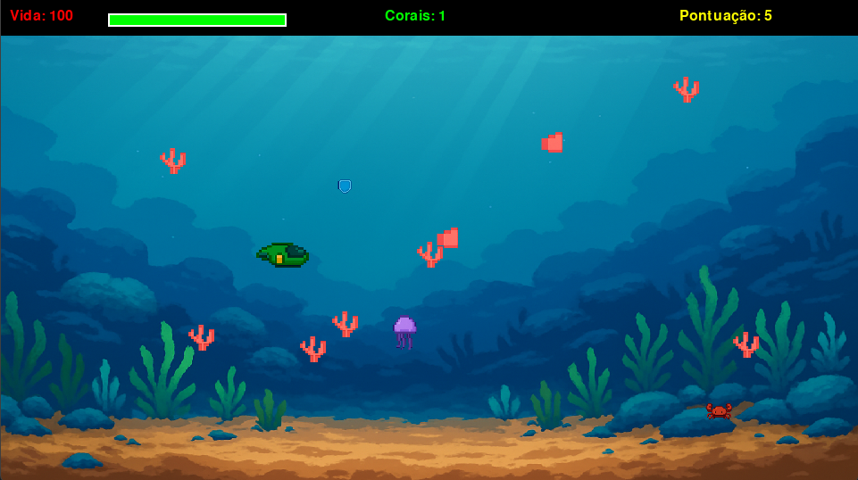

# Aventura Submarina: O Resgate dos Corais (Python)




Um jogo 2D side-scroller submarino desenvolvido em Python com pygame.

## Estrutura do Projeto

```
aventura_submarina/
├── game_manager.py      # Gerenciador principal (menu, jogo, vitória)
├── main.py              # Lógica principal do jogo
├── player.py            # Classe do jogador e projéteis
├── enemy.py             # Classe dos inimigos
├── coral.py             # Classe dos corais coletáveis
├── boss.py              # Classe do chefe final
├── menu.py              # Menu principal e tela de vitória
├── sound_manager.py     # Gerenciador de sons e música
├── sprite_loader.py     # Carregador de sprites
├── powerup.py          # Sistema de power-ups
├── build.spec           # Configuração PyInstaller
├── requirements.txt     # Dependências do projeto
├── README.md           # Este arquivo
└── assets/             # Recursos do jogo
    ├── images/         # Imagens e sprites
    └── sounds/         # Sons e músicas
```

## Instalação

1. Certifique-se de ter Python 3.7+ instalado
2. Instale as dependências:
   ```bash
   pip install -r requirements.txt
   ```

## Como Jogar

Execute o arquivo principal:
```bash
python game_manager.py
```

### Controles
- **W/↑**: Mover para cima
- **S/↓**: Mover para baixo
- **A/←**: Mover para esquerda
- **D/→**: Mover para direita
- **ESPAÇO**: Atirar
- **ESC**: Sair do jogo

### Objetivos
- **Coletar corais**: Toque nos corais coloridos para coletá-los
- **Destruir inimigos**: Atire nos peixes hostis para ganhar pontos
- **Sobreviver**: Mantenha sua vida alta!

## Funcionalidades Atuais

- ✅ Janela do jogo (960x540)
- ✅ Fundo azul oceânico
- ✅ HUD com vida e pontuação
- ✅ Submarino placeholder no canto esquerdo inferior
- ✅ **Movimento do submarino (WASD/setas)**
- ✅ **Limites de tela para o submarino**
- ✅ **Sistema de tiro (ESPAÇO)**
- ✅ **Projéteis que se movem para a direita**
- ✅ **Inimigos (peixes hostis) que surgem da direita**
- ✅ **Sistema de colisão e pontuação**
- ✅ **Sistema de coleta de corais**
- ✅ **Corais que reaparecem em posições diferentes**
- ✅ **Barra de vida visual**
- ✅ **Contador de corais coletados**
- ✅ **Chefe final (polvo gigante)**
- ✅ **Menu principal com botão Jogar**
- ✅ **Tela de vitória após derrotar o chefe**
- ✅ **Música de fundo relaxante**
- ✅ **Efeitos sonoros (tiro, coral, dano, vitória)**
- ✅ **Sistema de sprites com imagens reais**
- ✅ **Power-ups coletáveis (escudo, velocidade, super tiro)**
- ✅ **Sistema pronto para compilação com PyInstaller**
- ✅ Controle de framerate (60 FPS)
- ✅ Estrutura base organizada

## Compilação

Para criar um executável standalone:

```bash
# Instalar dependências
pip install -r requirements.txt

# Compilar com PyInstaller
pyinstaller build.spec

# Ou usar comando direto
pyinstaller --onefile --windowed --add-data "assets:assets" game_manager.py
```

O executável será criado na pasta `dist/`.

## Próximas Funcionalidades

- [ ] Sprites e animações
- [ ] Diferentes tipos de inimigos
- [ ] Power-ups
- [ ] Sistema de vidas (dano ao jogador)
- [ ] Tela de game over
- [ ] Diferentes tipos de projéteis
- [ ] Mais tipos de corais
- [ ] Efeitos visuais de coleta
- [ ] Múltiplas fases
- [ ] Sistema de save/load 